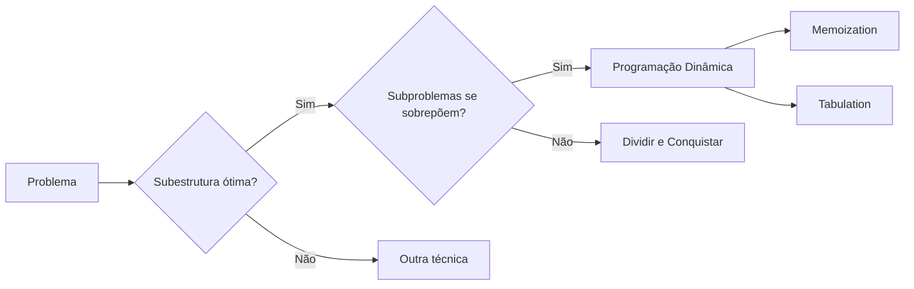
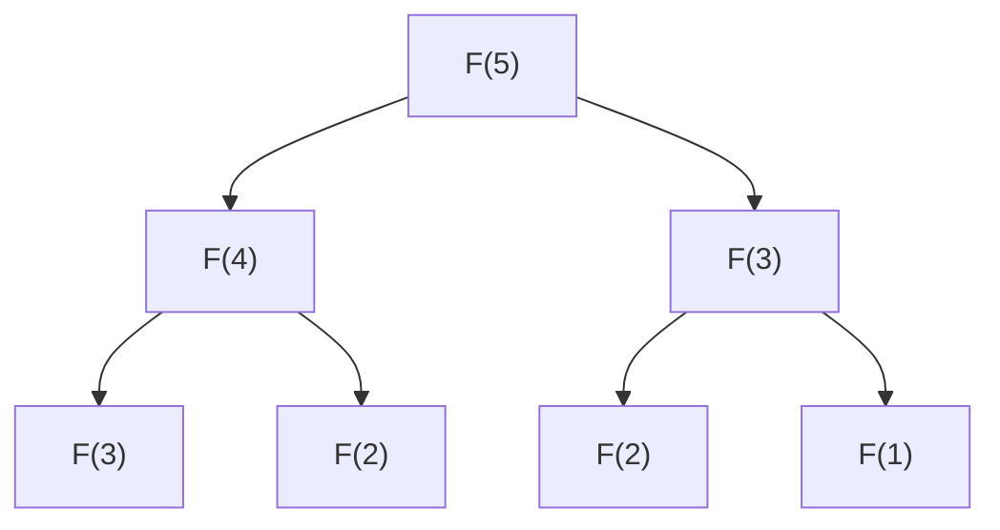
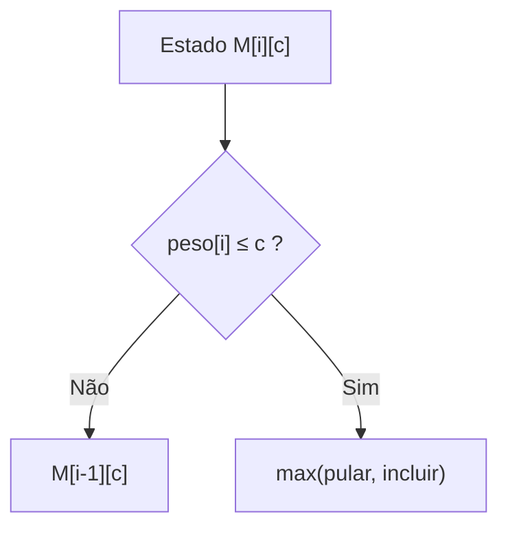
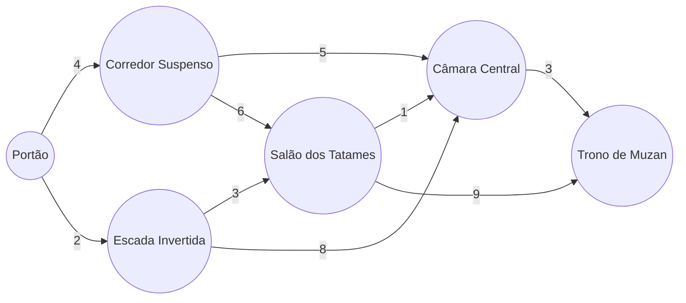
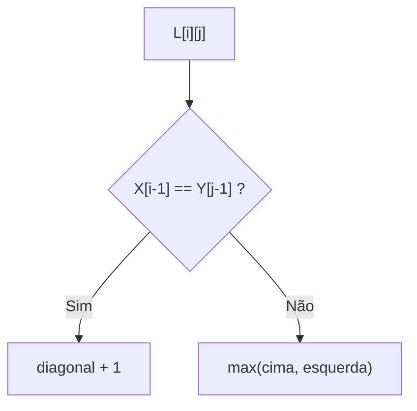

<!-- ===================== CAPA ===================== -->
<div align="center">

# Problemas Clássicos de Programação Dinâmica

**Universidade Federal do Ceará**
Disciplina: **Projeto e Análise de Algoritmos**

### Grupo 8

*Fibonacci · Mochila 0/1 · Caminho Mínimo · Subsequência Comum Máxima (LCS)*

</div>

---

## Sumário

- [Introdução à Programação Dinâmica](#introdução-à-programação-dinâmica)
- [Fibonacci](#fibonacci)
- [Mochila 0/1](#mochila-01)
- [Caminho Mínimo](#caminho-mínimo)
- [Subsequência Comum Máxima (LCS)](#subsequência-comum-máxima-lcs)
- [Comparação Geral](#comparação-geral)
- [Aplicações Reais](#aplicações-reais)
- [Estrutura do Projeto](#estrutura-do-projeto)
- [Como Executar](#como-executar)
- [Documentação Complementar](#documentação-complementar)
- [Referências](#referências)

---

## Introdução à Programação Dinâmica

**Programação Dinâmica (PD)** é uma técnica de projeto de algoritmos para
problemas de otimização e contagem que se decompõem em subproblemas que se
**repetem**. A ideia central: resolver cada subproblema **uma única vez** e
guardar o resultado, eliminando a recomputação que torna a recursão ingênua
exponencial.

Um problema é resolvível por PD quando satisfaz duas propriedades:

- **Sobreposição de subproblemas**, o algoritmo recursivo revisita os mesmos
  subproblemas muitas vezes, embora o número de subproblemas *distintos* seja
  polinomial. (É o que a árvore de recursão do Fibonacci escancara.)
- **Subestrutura ótima**, a solução ótima do problema é composta por soluções
  ótimas de seus subproblemas.

Há duas formas canônicas de implementar:

| | **Memoization** (top-down) | **Tabulation** (bottom-up) |
|---|---|---|
| Direção | do problema para a base | da base para o problema |
| Mecanismo | recursão + cache | iteração preenchendo tabela |
| Forte em | só calcula estados alcançados | sem pilha; permite economizar memória |



> Aprofundamento teórico em [`docs/teoria.md`](docs/teoria.md).

---

## Fibonacci

### Teoria
A sequência de Fibonacci é o "Hello World" da PD: cada termo é a soma dos dois
anteriores. Modela crescimento em que o estado atual depende dos dois estados
imediatamente passados.

### Fórmula e recorrência

```
        ┌ 0                    se n = 0
F(n) = ─┤ 1                    se n = 1
        └ F(n-1) + F(n-2)      se n ≥ 2
```

### Exemplo autoral: o exército de demônios de Muzan (Demon Slayer)
Cada demônio fortalecido transforma um humano por noite; o recém-transformado
leva uma noite para ganhar força e só então passa a transformar outros. O total
de demônios fortalecidos na noite `n` é `F(n)`. Na noite 7 → **13 demônios**.
(Detalhes em [`docs/exemplos.md`](docs/exemplos.md).)



### Complexidade

| Abordagem | Tempo | Espaço |
|-----------|-------|--------|
| Recursivo | Θ(φⁿ) | O(n) |
| Memoization | Θ(n) | Θ(n) |
| Tabulation | Θ(n) | **Θ(1)** |

### Código
[`src/fibonacci.py`](src/fibonacci.py), versões recursiva, memoization
(explícita e via `lru_cache`) e tabulation.

### Aplicações
Crescimento populacional, modelos financeiros, análise de algoritmos (números de
Fibonacci aparecem em heaps de Fibonacci e na análise do algoritmo de Euclides).

---

## Mochila 0/1

### Definição
Dado um conjunto de `n` itens, cada um com peso `wᵢ` e valor `vᵢ`, e uma
capacidade `W`, escolher um subconjunto que **maximize o valor total** sem
exceder `W`. Cada item entra inteiro ou não entra.

### Formulação matemática

```
maximizar   V = Σ (vᵢ · xᵢ)        para i = 1..n
sujeito a   Σ (wᵢ · xᵢ) ≤ W
            xᵢ ∈ {0, 1}
```

### Recorrência (tabela DP)

```
           ┌ 0                                              se i = 0
M[i][c] = ─┤ M[i-1][c]                                      se wᵢ > c
           └ max( M[i-1][c],  vᵢ + M[i-1][c-wᵢ] )           se wᵢ ≤ c
```



### Exemplo autoral: a mochila do treinador Pokémon
Mochila com 10 espaços; escolher itens que maximizem a utilidade em batalha
antes da Liga. Solução ótima: **Super Poção + Repelente + Ultra Ball =
utilidade 33** (e por que o guloso falha) em [`docs/exemplos.md`](docs/exemplos.md).

### Complexidade
DP: tempo **O(n·W)**, espaço O(n·W) (ou O(W) com um vetor). Pseudo-polinomial.

### Código
[`src/mochila.py`](src/mochila.py), força bruta, DP com reconstrução e versão
otimizada em espaço.

### Aplicações
Seleção de investimentos sob orçamento, corte de estoque, alocação de recursos,
empacotamento de carga.

---

## Caminho Mínimo

### Conceito
Em um **DAG** (grafo dirigido acíclico), o caminho de custo mínimo entre dois
vértices é resolvível por PD: o menor custo até `v` depende do menor custo até
seus predecessores. A aciclicidade garante uma ordem topológica de avaliação.

### Modelagem / recorrência

```
        ┌ 0                                    se v = s (origem)
d[v] = ─┤
        └ min ( d[u] + w(u,v) )                para toda aresta (u,v) ∈ E
```

### Exemplo autoral: a Fortaleza Infinita de Muzan (Demon Slayer)
Salas ligadas por passagens de mão única; rota mais rápida do `Portão` ao
`Trono de Muzan`.



Rota ótima: `Portão → Escada Invertida → Salão dos Tatames → Câmara Central →
Trono de Muzan` = **9 min**.

### Complexidade
**Θ(V + E)**, mais rápido que Dijkstra e aceita pesos negativos (sem ciclos).

### Código
[`src/caminho_minimo.py`](src/caminho_minimo.py), ordenação topológica (Kahn)
+ relaxamento + reconstrução da rota.

### Aplicações
Escalonamento de tarefas (PERT/CPM), pipelines de build, planejamento de rotas
em mapas direcionados.

---

## Subsequência Comum Máxima (LCS)

### Conceito
A **maior subsequência comum** entre duas sequências: maior conjunto de
elementos que aparece em ambas, na mesma ordem relativa, **não necessariamente
contíguos**.

### Recorrência

```
           ┌ 0                                  se i = 0 ou j = 0
L[i][j] = ─┤ L[i-1][j-1] + 1                     se X[i] = Y[j]
           └ max( L[i-1][j],  L[i][j-1] )        se X[i] ≠ Y[j]
```

### Matriz e reconstrução



### Exemplo autoral: comparando times Pokémon
Comparar a ordem dos times de dois treinadores e achar a "espinha dorsal" comum:
**[Charmander, Squirtle, Pikachu, Gengar]**, LCS = 4. Ver
[`docs/exemplos.md`](docs/exemplos.md).

### Código
[`src/lcs.py`](src/lcs.py), recursivo, DP com reconstrução e geração da matriz.

### Complexidade
DP: tempo **O(m·n)**, espaço O(m·n) (ou O(min(m,n)) só para o comprimento).

### Aplicações
`git diff`, controle de versões, alinhamento de DNA/proteínas, correção
ortográfica, detecção de plágio.

---

## Comparação Geral

| Problema | Estado | Recorrência (núcleo) | Tempo (DP) | Espaço (DP) | Aplicações |
|----------|--------|----------------------|-----------|-------------|------------|
| **Fibonacci** | `n` | `F(n)=F(n-1)+F(n-2)` | Θ(n) | Θ(1) | Modelos de crescimento |
| **Mochila 0/1** | `(i, c)` | `max(M[i-1][c], vᵢ+M[i-1][c-wᵢ])` | O(n·W) | O(n·W)→O(W) | Orçamento, carga, estoque |
| **Caminho mín. (DAG)** | `v` | `min d[u]+w(u,v)` | Θ(V+E) | Θ(V+E) | Escalonamento, rotas |
| **LCS** | `(i, j)` | igual→diag+1; senão max(↑,←) | O(m·n) | O(m·n)→O(min) | Diff, DNA, plágio |

| Problema | Ingênuo | DP | Ganho |
|----------|---------|-----|-------|
| Fibonacci | Θ(φⁿ) | Θ(n) | Exponencial → Linear |
| Mochila 0/1 | Θ(2ⁿ) | O(n·W) | Exponencial → Pseudo-polinomial |
| Caminho (DAG) | até exponencial | Θ(V+E) | → Linear |
| LCS | O(2^(m+n)) | O(m·n) | Exponencial → Quadrático |

> Análise detalhada em [`docs/complexidade.md`](docs/complexidade.md).

---

## Aplicações Reais

- **GPS / navegação**, variantes de caminho mínimo planejam rotas (com DAGs em
  redes de tarefas e sistemas com dependências).
- **Git**, o `diff` usa LCS para alinhar versões de arquivos e gerar patches.
- **Bioinformática**, LCS e alinhamento de sequências comparam DNA, RNA e
  proteínas.
- **Logística**, mochila e caminho mínimo otimizam carga e roteamento de
  entregas.
- **Controle de estoque**, mochila modela seleção de produtos sob restrição de
  espaço/capital.
- **Machine Learning**, PD aparece em programação dinâmica diferenciável,
  algoritmos de sequência (Viterbi, DTW) e otimização de políticas em RL
  (equação de Bellman).

---

## Estrutura do Projeto

```
programacao-dinamica/
├── README.md                 # Este documento (capa, teoria, comparações)
├── apresentar.sh             # Demonstração ao vivo: roda os 4 algoritmos + testes
├── requirements.txt          # Dependências (apenas pytest, opcional)
├── src/                      # Código-fonte executável
│   ├── __init__.py
│   ├── fibonacci.py          # Recursivo, memoization, tabulation
│   ├── mochila.py            # Força bruta + DP (mochila 0/1)
│   ├── caminho_minimo.py     # Caminho mínimo em DAG (DP topológica)
│   └── lcs.py                # LCS recursivo + DP com reconstrução
├── docs/                     # Documentação técnica
│   ├── teoria.md             # Fundamentos da Programação Dinâmica
│   ├── complexidade.md       # Análise comparativa de complexidade
│   ├── exemplos.md           # Exemplos autorais passo a passo
│   ├── diagramas.md          # Todos os diagramas Mermaid
│   ├── apresentacao.md       # Guia de apresentação (5 integrantes)
│   └── perguntas.md          # 20 perguntas e respostas para a arguição
├── assets/                   # Recursos visuais auxiliares
│   ├── gerar_prints.py       # Gera os prints a partir do apresentar.sh
│   ├── saida_fibonacci.png   # Tela da demo de cada etapa (explicação + saída)...
│   ├── saida_mochila.png
│   ├── saida_caminho_minimo.png
│   ├── saida_lcs.png
│   └── saida_testes.png      # Tela dos testes (pytest -v + "26 passed")
└── tests/                    # Testes automatizados (pytest)
    ├── test_fibonacci.py
    ├── test_mochila.py
    ├── test_caminho_minimo.py
    └── test_lcs.py
```

---

## Como Executar

Requer **Python 3.12+**. Nenhuma dependência externa para rodar os algoritmos.

```bash
# Clonar e entrar no projeto
git clone <url-do-repositorio>
cd programacao-dinamica
```

**Demonstração completa (recomendado para a apresentação).** Um único comando
mostra uma tela por algoritmo, com contexto, e termina com os testes. A
navegação é pelas setas do teclado:

```bash
./apresentar.sh           # -> avança, <- volta, q sai (uma tela por vez)
./apresentar.sh --auto    # roda tudo de uma vez, sem interação
```

**Ou execute cada algoritmo isoladamente** (cada arquivo tem sua própria demo):

```bash
python3 src/fibonacci.py
python3 src/mochila.py
python3 src/caminho_minimo.py
python3 src/lcs.py
```

Para rodar os testes automatizados:

```bash
pip install pytest          # ou: pip install -r requirements.txt
python3 -m pytest tests/ -q
```

Saída esperada dos testes: `26 passed`.

---

## Documentação Complementar

| Documento | Conteúdo |
|-----------|----------|
| [`docs/teoria.md`](docs/teoria.md) | Fundamentos, receita de 4 passos, quando (não) usar PD |
| [`docs/complexidade.md`](docs/complexidade.md) | Tabelas ingênuo × DP e justificativas |
| [`docs/exemplos.md`](docs/exemplos.md) | Quatro exemplos autorais passo a passo |
| [`docs/diagramas.md`](docs/diagramas.md) | Diagramas Mermaid |
| [`docs/apresentacao.md`](docs/apresentacao.md) | Roteiro de fala da apresentação (15-25 min) |
| [`docs/guia-slides.md`](docs/guia-slides.md) | Guia slide a slide + demonstração de código ao vivo |
| [`docs/perguntas.md`](docs/perguntas.md) | 20 perguntas e respostas para a defesa |

---

## Referências

**Formato ABNT.**

CORMEN, Thomas H.; LEISERSON, Charles E.; RIVEST, Ronald L.; STEIN, Clifford.
**Algoritmos: teoria e prática**. 3. ed. Rio de Janeiro: Elsevier, 2012.

DASGUPTA, Sanjoy; PAPADIMITRIOU, Christos H.; VAZIRANI, Umesh V.
**Algorithms**. New York: McGraw-Hill, 2008.

KLEINBERG, Jon; TARDOS, Éva. **Algorithm Design**. Boston: Pearson/Addison-Wesley, 2006.

SKIENA, Steven S. **The Algorithm Design Manual**. 2. ed. London: Springer, 2008.

BELLMAN, Richard. **Dynamic Programming**. Princeton: Princeton University Press, 1957.

---

<div align="center">
Grupo 8, Projeto e Análise de Algoritmos, Universidade Federal do Ceará
</div>
