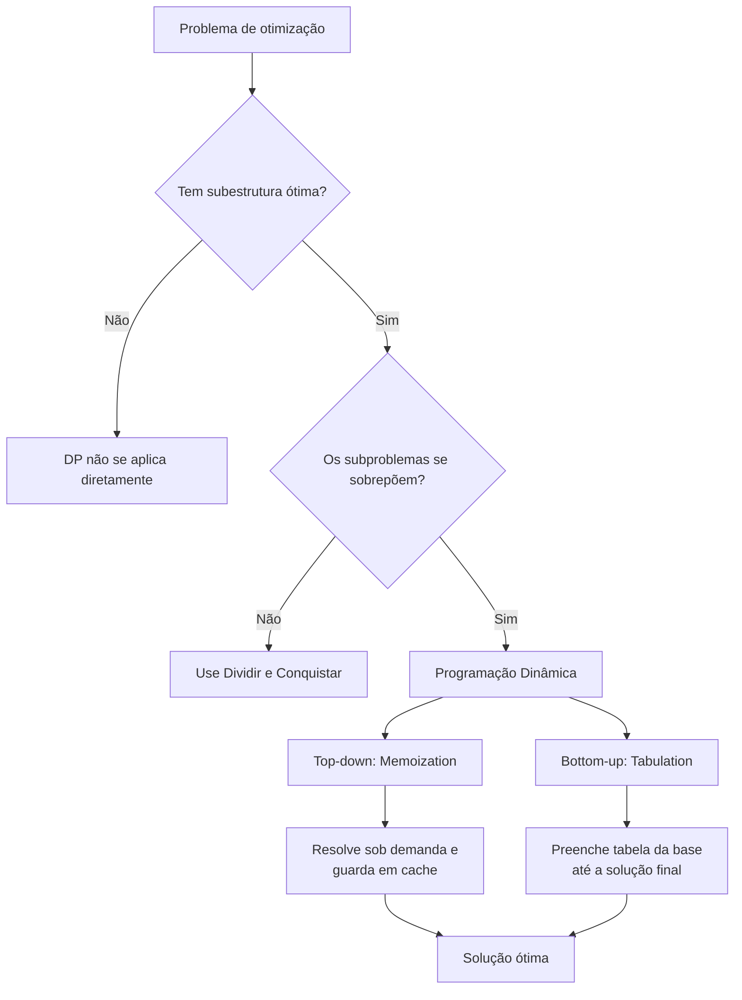
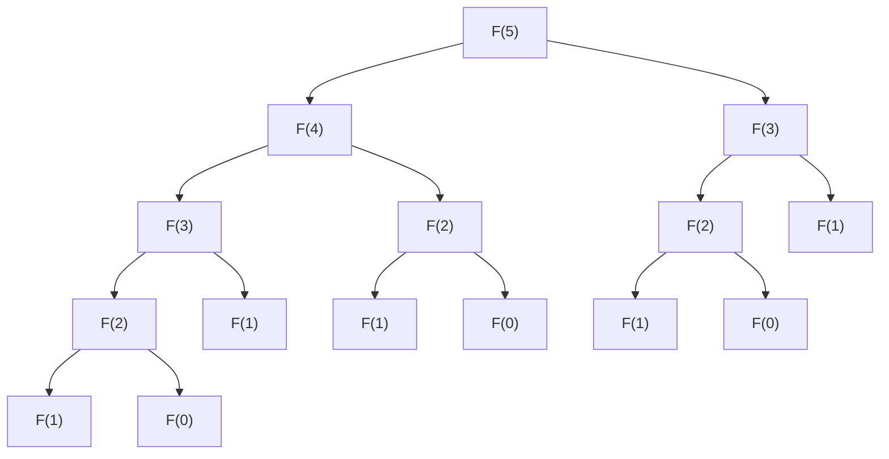
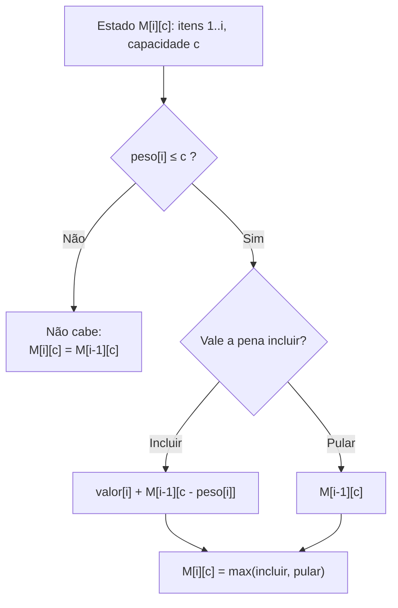
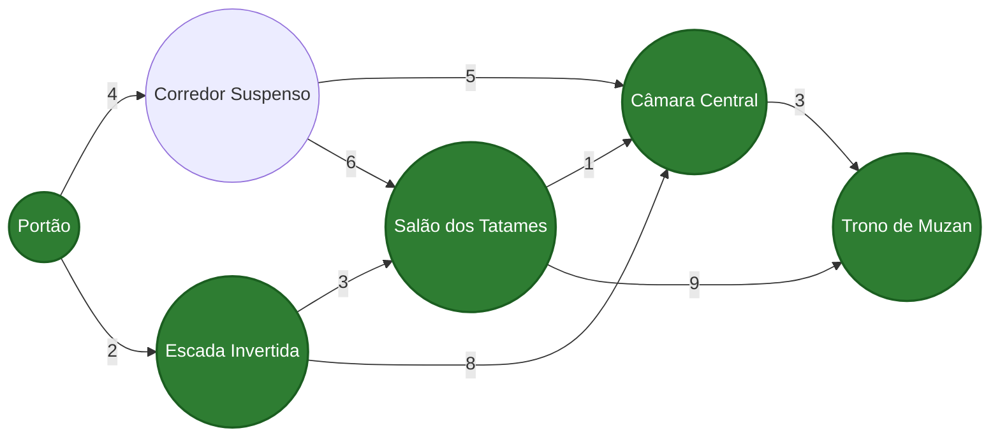
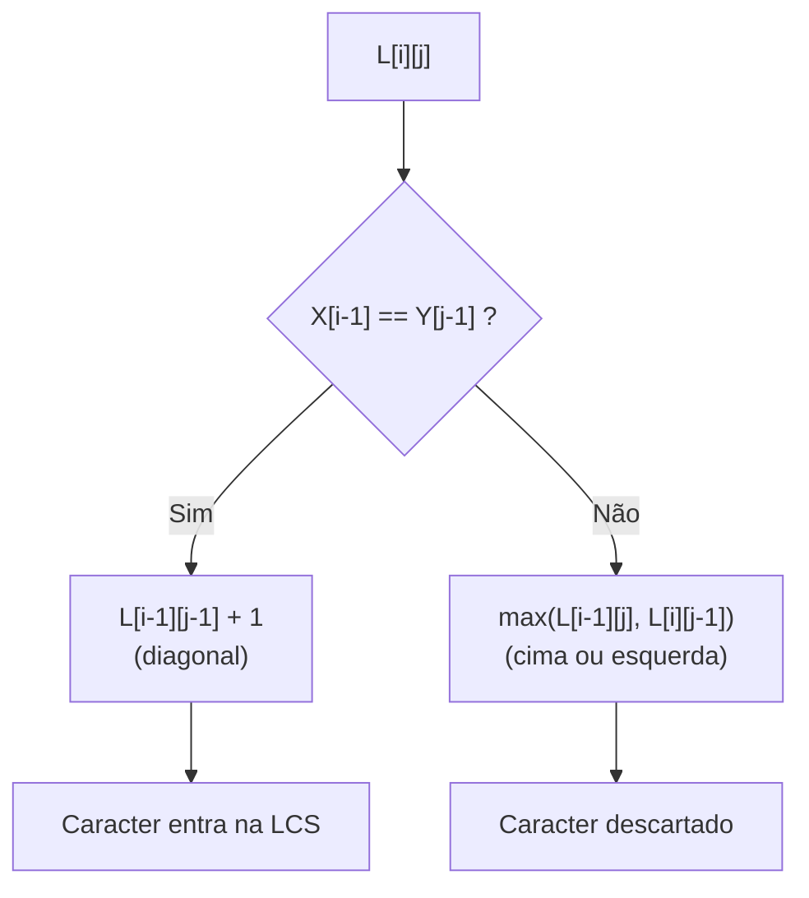
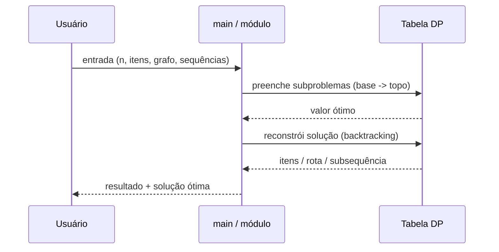
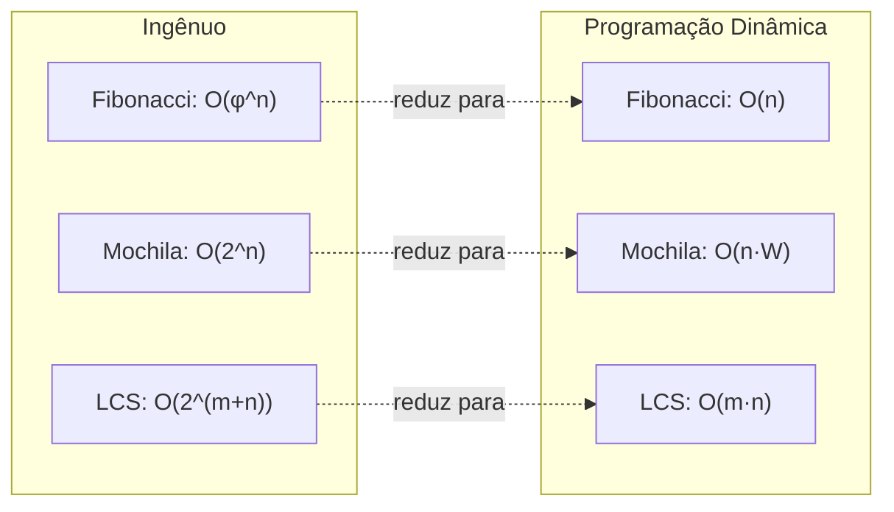

# Diagramas (Mermaid)

> Todos os diagramas abaixo são renderizados nativamente pelo GitHub. Basta
> visualizar este arquivo no repositório.

---

## 1. O método da Programação Dinâmica

---

## 2. Árvore de recursão do Fibonacci (recorrência ingênua)

Observe como `F(2)` e `F(1)` reaparecem várias vezes, é a **sobreposição de
subproblemas** que a DP elimina.

---

## 3. Mochila 0/1: decisão por item

---

## 4. Caminho mínimo em DAG: relaxamento em ordem topológica

> Em verde, a rota ótima `Portão → Escada Invertida → Salão dos Tatames → Câmara
> Central → Trono de Muzan` (custo total = 9 minutos).

---

## 5. Subsequência Comum Máxima (LCS): direção do preenchimento e da reconstrução

---

## 6. Fluxo geral de execução do projeto

---

## 7. Comparação de crescimento assintótico

